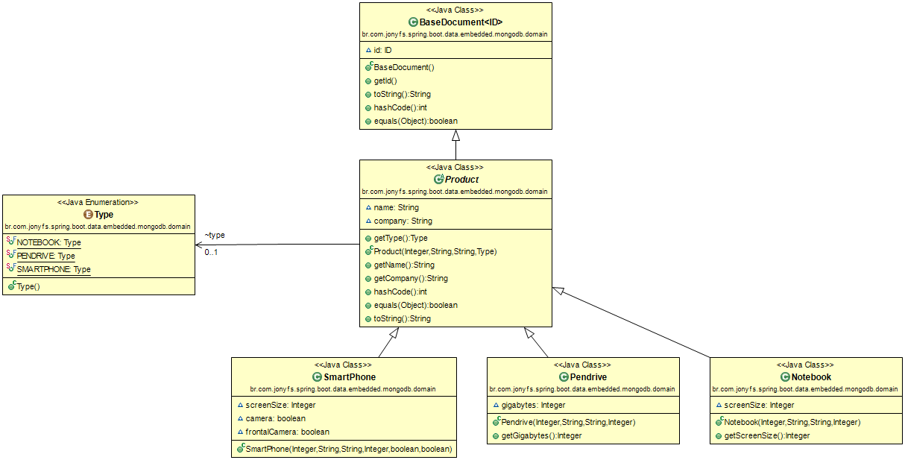

# A Spring Boot Application example with Spring Data Rest and Embedded MongoDB


### Class Diagram
Imagine a store with many different products...These products have specific characteristics...



### MongoDB Embebbed Config.
* Database: store
* Collections: products
* url: localhost
* port: 12345

Obs.: I used [RoboMongo](http://robomongo.org/) client to access data in MongoDB.


### Tools
[Spring Boot](http://projects.spring.io/spring-boot/)

[Spring Data Rest](http://projects.spring.io/spring-data-rest/)

[MongoDB](https://www.mongodb.com/)

[embedmongo-spring](https://github.com/jirutka/embedmongo-spring)

[de.flapdoodle.embed.mongo](https://github.com/flapdoodle-oss/de.flapdoodle.embed.mongo)

### Run it!
mvn package spring-boot:run

### Urls
* [http://localhost:8080/api/](http://localhost:8080/api/)

```javascript	
{
  "_links" : {
    "products" : {
      "href" : "http://localhost:8080/api/products{?page,size,sort}",
      "templated" : true
    },
    "profile" : {
      "href" : "http://localhost:8080/api/alps"
    }
  }
}
```
	
* [http://localhost:8080/api/products{?page,size,sort}](http://localhost:8080/api/products{?page,size,sort})

```javascript	
{
  "_links" : {
    "self" : {
      "href" : "http://localhost:8080/api/products{?page,size,sort}",
      "templated" : true
    },
    "next" : {
      "href" : "http://localhost:8080/api/products?page=1&size=5{&sort}",
      "templated" : true
    }
  },
  "_embedded" : {
    "pendrives" : [ {
      "id" : 4,
      "name" : "Data Traveler ",
      "company" : "Kingston",
      "type" : "PENDRIVE",
      "gigabytes" : 16,
      "_links" : {
        "self" : {
          "href" : "http://localhost:8080/api/products/4"
        }
      }
    }, {
      "id" : 5,
      "name" : "Cruzer Fit",
      "company" : "Sandisk",
      "type" : "PENDRIVE",
      "gigabytes" : 32,
      "_links" : {
        "self" : {
          "href" : "http://localhost:8080/api/products/5"
        }
      }
    } ],
    "notebooks" : [ {
      "id" : 1,
      "name" : "MacBook Pro",
      "company" : "Apple",
      "type" : "NOTEBOOK",
      "screenSize" : 15,
      "_links" : {
        "self" : {
          "href" : "http://localhost:8080/api/products/1"
        }
      }
    } ],
    "smartPhones" : [ {
      "id" : 2,
      "name" : "Moto X",
      "company" : "Motorola",
      "type" : "SMARTPHONE",
      "_links" : {
        "self" : {
          "href" : "http://localhost:8080/api/products/2"
        }
      }
    }, {
      "id" : 3,
      "name" : "Iphone 6 Plus",
      "company" : "Apple",
      "type" : "SMARTPHONE",
      "_links" : {
        "self" : {
          "href" : "http://localhost:8080/api/products/3"
        }
      }
    } ]
  },
  "page" : {
    "size" : 5,
    "totalElements" : 6,
    "totalPages" : 2,
    "number" : 0
  }
}
```


